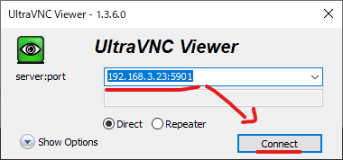
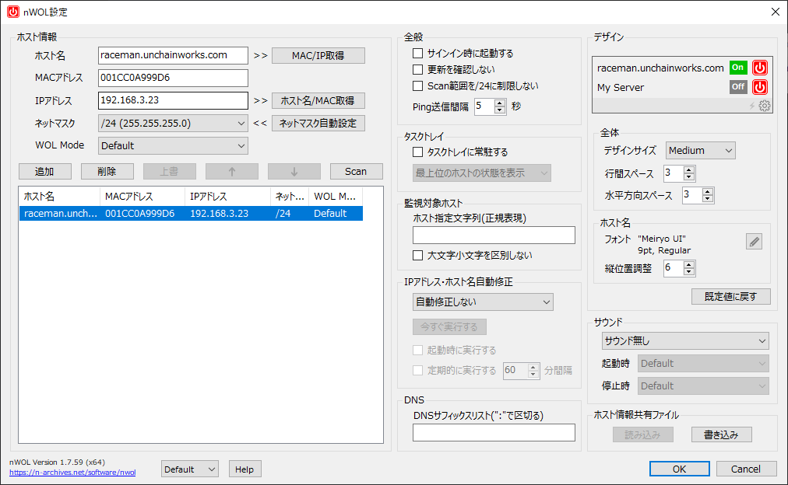
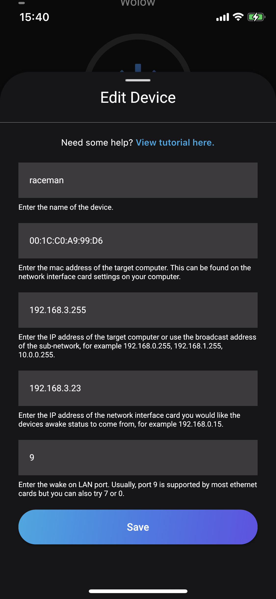

# D945GCLF


## 製品名

* intel デスクトップ・ボード D945GCLF

  


## 仕様

- [基本仕様](https://ark.intel.com/content/www/jp/ja/ark/products/42490/intel-desktop-board-d945gclf.html)

  

## スタートアップ

1. CentOS7のインストール

2. rootユーザーパスワード設定

3. ネットワーク設定

   インターフェース：enp1s0

   デフォルトでconnection.autoconnect=noとなっていたので再起動すると切断状態となってしまう。

   以下のコマンドで自動接続するよう設定

   ```sh
   $nmcli con mod enp1s0 connection.autoconnet "yes"
   ```

4. SSH設定

5. 一般ユーザー追加・sudo設定

6. ホスト名変更

7. システム最新化

8. リポジトリ追加

9. vimインストール・設定

10. デスクトップ環境構築

    1. GNOMEインストール

       ```sh
       $yum -y groups install "GNOME Desktop"
       ```

    2. GNOME起動確認

       ```sh
       $startx
       ```

    3. VNCインストール

       ```sh
       $yum -y install tigervnc-server
       ```

    4. VNCパスワード設定

       VNC接続させたいユーザーでログインした状態で以下のコマンド実行

       ```sh
       $vncpasswd
       Password:(任意のパスワード)
       Verify:（任意のパスワード再入力）
       Would you like to enter a view-only password (y/n)? n　（見るだけの権限が必要か？）
       ```

    5. ファイアーウォール設定でVNC接続許可

       ```sh
       $firewall-cmd --permanent --add-port=5901/tcp
       $firewall-cmd --reload
       ```

    6. VNC起動確認

       ```sh
       $vncserver :1
       ```

       この後、クライアント側からVNCビューアーで接続できるか確認する。

       
       
    7. VNCサービス登録

       設定ファイルコピー

       ```sh
       $cp -p /lib/systemd/system/vncserver@.service /etc/systemd/system/vncserver@:1.service
       $vim /etc/systemd/system/vncserver@:1.service
       ```

       設定ファイル編集

       <USER>の箇所は接続ユーザーに置き換える

       ```sh
       [Unit]
       Description=Remote desktop service (VNC)
       After=syslog.target network.target
       
       [Service]
       Type=simple
       
       # Clean any existing files in /tmp/.X11-unix environment
       ExecStartPre=/bin/sh -c '/usr/bin/vncserver -kill %i > /dev/null 2>&1 || :'
       ExecStart=/usr/bin/vncserver_wrapper <USER> %i
       ExecStop=/bin/sh -c '/usr/bin/vncserver -kill %i > /dev/null 2>&1 || :'
       
       [Install]
       WantedBy=multi-user.target
       ```

       サービス登録

       ```sh
       $systemctl daemon-reload
       $systemctl start vncserver@:1.service
       $systemctl enable vncserver@:1.service
       ```

       上記実施後、rebootしてVNCクライアントから接続できるか確認する。
       
       

11. Wake On Lan設定

    1. ethtoolインストール

       ```sh
       $yum -y install ethtool
       ```

    2. ethtool設定

       ```sh
       $ethtool -s <ネットワークデバイス名> wol g
       ```

       ネットワークデバイス名は以下のコマンドで確認

       ```sh
       $nmcli -d
       ```

    3. 設定後確認

       ```sh
       $ethtool enp1s0 | grep Wake-on
           Supports Wake-on: pumbg
           Wake-on: g
       ```

    4. 設定を恒久化

       ```sh
       $nmcli connection modify enp1s0 ethernet.wake-on-lan magic
       ```

    5. クライアント側(Windows)

       nWOLをインストール。以下のように設定。

       

    6. クライアント側(iOS)

       Wolowをインストール。以下のように設定。

       

    

12. Docker

    1. インストール

       ```sh
       $curl https://download.docker.com/linux/centos/docker-ce.repo -o /etc/yum.repos.d/docker-ce.repo
       $sed -i -e "s/enabled=1/enabled=0/g" /etc/yum.repos.d/docker-ce.repo
       $yum --enablerepo=docker-ce-stable -y install docker-ce
       ```

    2. サービス登録

       ```sh
       $systemctl enable --now docker
       ```

    3. 確認

       ```sh
       $rpm -q docker-ce
       docker-ce-20.10.12-3.el7.x86_64
       
       $docker version
       Client: Docker Engine - Community
        Version:           20.10.12
        API version:       1.41
        Go version:        go1.16.12
        Git commit:        e91ed57
        Built:             Mon Dec 13 11:45:41 2021
        OS/Arch:           linux/amd64
        Context:           default
        Experimental:      true
       
       Server: Docker Engine - Community
        Engine:
         Version:          20.10.12
         API version:      1.41 (minimum version 1.12)
         Go version:       go1.16.12
         Git commit:       459d0df
         Built:            Mon Dec 13 11:44:05 2021
         OS/Arch:          linux/amd64
         Experimental:     false
        containerd:
         Version:          1.4.13
         GitCommit:        9cc61520f4cd876b86e77edfeb88fbcd536d1f9d
        runc:
         Version:          1.0.3
         GitCommit:        v1.0.3-0-gf46b6ba
        docker-init:
         Version:          0.19.0
         GitCommit:        de40ad0
       ```

    4. CentOSの公式イメージファイルをダウンロード

       ```sh
       $docker pull centos
       Using default tag: latest
       latest: Pulling from library/centos
       a1d0c7532777: Pull complete
       Digest: sha256:a27fd8080b517143cbbbab9dfb7c8571c40d67d534bbdee55bd6c473f432b177
       Status: Downloaded newer image for centos:latest
       docker.io/library/centos:latest
       ```

    5. コンテナで echo 実行(確認)

       ```sh
       $docker run centos /bin/echo "Welcome to the Docker World"
       ```

    6. コンテナの対話型セルセッション接続(コンテナプロセス起動)

       ```sh
       $docker run -it centos /bin/bash
       [root@a9ae2f713662 /]$         # コンテナのコンソール
       [root@a9ae2f713662 /]$exit     # コンテナ環境のプロセス終了
       exit
       $                              # 戻った
       ```

    7. コンテナの対話型セルセッションからコンテナ環境のプロセスを残したままホストに戻る

       ```sh
       $docker run -it centos /bin/bash
       [root@a9ae2f713662 /]$[root@raceman ~]$        # [Ctrl]+p [Ctrl]+qでホストに戻る
       $docker ps # dockerプロセス表示
       CONTAINER ID   IMAGE     COMMAND       CREATED         STATUS         PORTS     NAMES
       a9ae2f713662   centos    "/bin/bash"   5 minutes ago   Up 4 minutes             blissful_goodall
       
       # 再びコンテナ環境に接続する(CONTAINER IDを指定)
       $docker attach a9ae2f713662
       [root@a9ae2f713662 /]$ # コンテナに接続された
       
       # ホスト側からコンテナ環境のプロセスを終了する
       $docker kill a9ae2f713662
       ```

13. Docker-Compose

    1. インストール

       ```sh
       $curl -L https://github.com/docker/compose/releases/download/1.27.4/docker-compose-$(uname -s)-$(uname -m) -o /usr/local/bin/docker-compose
       ```

    2. パーミッション変更

       ```sh
       $chmod 755 /usr/local/bin/docker-compose
       ```

    3. バージョン確認

       ```sh
       $docker-compose --version
       docker-compose version 1.27.4, build 40524192
       ```

14. postgresのコンテナ化

    1. フォルダ構成

       ```sh
       [docker-directory]/
        ┗ [postgres-version]/
             ┣ DockerFile
             ┣ docker-compose.yml
             ┗ pgdata # postgresのデータファイルが入る
       ```

    2. DockerFile作成(下記はpostgres12の場合)

       ```sh
       $vim Dockerfile
       
       FROM postgres:12-alpine
       ENV LANG ja_JP.utf8
       ```

    3. docker-compose.yml作成

       ```sh
       version: '3'
        services:
          pg12: # service名
          build: .
          ports: # 
            - 5435:5432 
            # 左がホスト側の接続ポート、右はコンテナ側のポート番号
            # ホスト側の接続ポートはfirewallでポート開放しておく(下記コマンド参照)
          environment:
        　　  POSTGRES_USER: netkeiber # postgresユーザー
        　　  POSTGRES_PASSWORD: pgstock # postgresユーザーのパスワード
        　　  POSTGRES_DB: raceanalyze # データベース名
        　　  volumes: # postgresデータの保存先指定(dockerディレクトリにあるpgdataの実態は/var/lib/posgresql/dataに保存される)
        　　    - ./pgdata:/var/lib/postgresql/data
        　　  restart: always # OS起動時にコンテナを起動する場合はalwaysを指定
       ```

       ポート開放コマンド(例)：

       ポート番号5435を解放する

       ```sh
       $firewall-cmd --add-port=5435/tcp --permanent
       $firewall-cmd --reload
       ```

    4. コンテナを作成する

       事前にdocker-compose.ymlが配置してあるディレクトリに移動する

       ```sh
       $docker-compose up -d
       ```

    5. コンテナの一覧を確認

       ```sh
       $docker container ls -a
       ```

15. httpdのコンテナ化

    1. フォルダ構成

       ```sh
       [docker-directory]/
        ┗ [httpd]/
             ┣ DockerFile
             ┣ docker-compose.yml
             ┗ html # webコンテンツを格納
       ```

    2. DockerFile作成

       ```sh
       $vim Dockerfile
       
       FROM httpd:alpine
       ```

    3. docker-compose.yml作成

       ```sh
       version: '3'
       services:
         web:
         build: .
         ports:
           - "8081:80"
         volumes:
           - ./html/:/usr/local/apache2/htdocs/
         restart: always
       ```

    4. コンテナを作成する

       事前にdocker-compose.ymlが配置してあるディレクトリに移動する

       ```sh
       $docker-compose up -d
       ```

16. Selenium動作環境

    1. chromeリポジトリ設定

       ```sh
       vim /etc/yum.repos.d/google-chrome.repo
       
       [google-chrome]
       name=google-chrome
       baseurl=http://dl.google.com/linux/chrome/rpm/stable/$basearch
       enabled=0
       gpgcheck=1
       gpgkey=https://dl-ssl.google.com/linux/linux_signing_key.pub
       ```

    2. chromeインストール

       ```sh
       $yum -y install --enablerepo=google-chrome google-chrome-stable
       ```

    3. バージョン確認(このバージョンと後続の手順で配置するchromedriverのバージョンを合わせる)

       ```sh
       $google-chrome --version
       
       Google Chrome 103.0.5060.134
       ```

    4. chromedriverダウンロード

       ```sh
       $wget https://chromedriver.storage.googleapis.com/103.0.5060.134/chromedriver_linux64.zip
       ```

    5. chromedriver_linux64.zip解凍

       ```sh
       $unzip chromedriver_linux64.zip
       ```

    6. パスが通っている場所にchromedriverを移動

       ```sh
       $mv chromedriver /usr/local/bin/
       ```

    7. パーミッションを755に変更

       ```sh
       $chmod 755 /usr/local/bin/chromedriver
       ```

    8. 不要になったchromedriver_linux64.zipを削除

       ```sh
       $rm chromedriver_linux64.zip
       ```

    9. webdriverオプション
    
       webdriverに対して以下のオプションを設定する
    
       - --headless
    
       - --no-sandbox
    
       - --remote-debugging-port=9222
    
         ```sh
         例) netkeiber.iniのWEBDRIVER_OPTIONSに以下の設定を追加
         
         ;WebDriver Options
         WEBDRIVER_OPTIONS = --headless,--no-sandbox,--remote-debugging-port=9222
         ```
    
         上記オプションがないと以下のエラーを吐いてブラウザが起動しない
    
         ```sh
         type:<class 'selenium.common.exceptions.WebDriverException'>
         args:("unknown error: Chrome failed to start: exited abnormally.\n  (unknown error: DevToolsActivePort file doesn't exist)\n  (The process started from chrome location /usr/bin/google-chrome is no longer running, so ChromeDriver is assuming that Chrome has crashed.)", None, None)
         e自身:Message: unknown error: Chrome failed to start: exited abnormally.
           (unknown error: DevToolsActivePort file doesn't exist)
           (The process started from chrome location /usr/bin/google-chrome is no longer running, so ChromeDriver is assuming that Chrome has crashed.)
         ```
