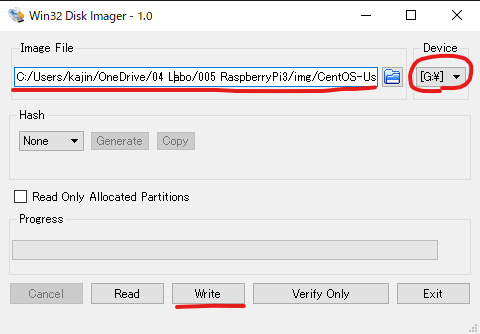

# RaspberryPi

## 製品名

- RaspberryPi Model B+

## 仕様

- CPU:700 MHz / ARM1176JZF-Sコア(ARM11ファミリ)

- GPU:Broadcom VideoCore IV,OpenGL ES 2.0, 1080p 30fps H.264/MPEG-4 AVC high-profile デコーダー

- メモリ(SDRAM):512MB

- USB 2.0 ポート:4 (統合USBハブ)

- 映像出力:HDMI(rev1.3&1.4),コンポジットビデオ(3.5mm4極ジャック)
  
- 音声出力:HDMI,3.5mm4極ジャック

- ストレージ:microSDメモリーカードスロット(SDIO対応)

- ネットワーク:10/100Mbpsイーサネット

- カメラコネクタ:15ピン MIPIカメラシリアルインターフェーズ(CSI-2) コネクタ搭載

- ディスプレイコネクタ:Display Serial Interface(DSI) 15ピンフラットケーブルコネクタ

- 電源ソース:5V / USB Micro-Bコネクタ または GPIOコネクタ

- 寸法:85mm × 56mm
  
- OS:Debian, Fedora, Arch Linux

## スタートアップ

### 1.パーテーションが存在するSDカードの初期化

1. コマンドプロンプトで「diskpart」を実行

2. 「list disk」で初期化するSDカードのディスク番号を調べる

3. 「select disk [ディスク番号]」を選択する

4. 「list partition」でパーテーションを確認して選択している番号が正しいことを確認

5. 「clean」で初期化する

    

### 1.SDカードをフォーマットする

1. [SD/SDHC/SHXC用SDメモリカードフォーマッター5.0](https://1drv.ms/u/s!AtZZJevIaEATgvwe7Z7nzBiXVOm58w?e=nedXd8)を使用

    

    ※基本は上書きフォーマットで実行

    [クイックフォーマットと上書きフォーマットの違い](https://www.sdcard.org/ja/downloads-2/formatter-2/faq/#faq13)

### 2.SDカードへCentOSのimgファイルを書き込む

1. [CensOSのイメージファイル](https://buildlogs.centos.org/centos/7/isos/armhfp/CentOS-Userland-7-armv7hl-Minimal-1611-test-RaspberryPi3.img.xz)をダウンロードして7zipなどで展開する

2. Win32DiskImagerを使用して、imgファイルをSDカードに書き込む

    

### 3.起動後のネットワーク設定
