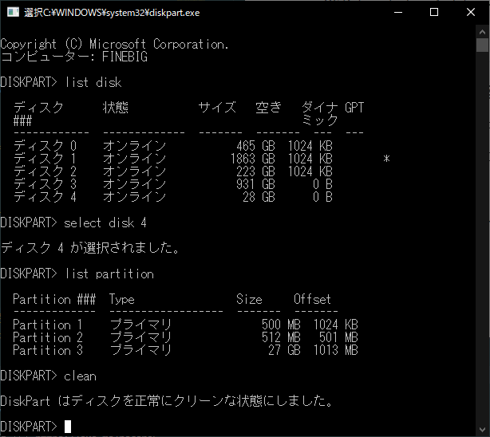
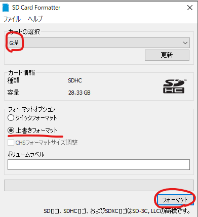
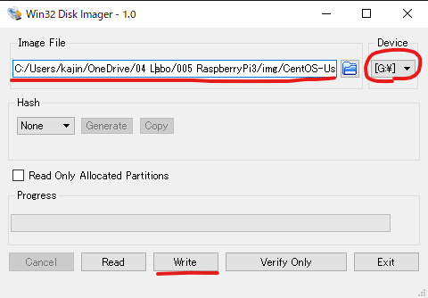
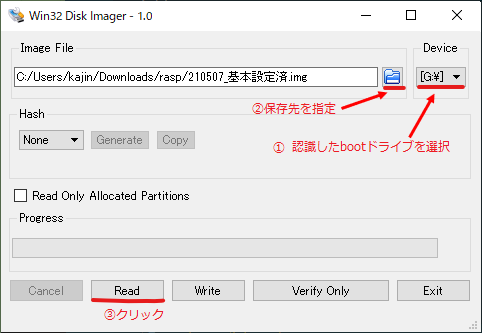

# RaspberryPi

## 製品名

* RaspberryPi Model B+

## 仕様

* CPU:700 MHz / ARM1176JZF-Sコア\(ARM11ファミリ\)
* GPU:Broadcom VideoCore IV,OpenGL ES 2.0, 1080p 30fps H.264/MPEG-4 AVC high-profile デコーダー
* メモリ\(SDRAM\):512MB
* USB 2.0 ポート:4 \(統合USBハブ\)
* 映像出力:HDMI\(rev1.3&1.4\),コンポジットビデオ\(3.5mm4極ジャック\)
* 音声出力:HDMI,3.5mm4極ジャック
* ストレージ:microSDメモリーカードスロット\(SDIO対応\)
* ネットワーク:10/100Mbpsイーサネット
* カメラコネクタ:15ピン MIPIカメラシリアルインターフェーズ\(CSI-2\) コネクタ搭載
* ディスプレイコネクタ:Display Serial Interface\(DSI\) 15ピンフラットケーブルコネクタ
* 電源ソース:5V / USB Micro-Bコネクタ または GPIOコネクタ
* 寸法:85mm × 56mm
* OS:Debian, Fedora, Arch Linux

## スタートアップ

### 1.パーテーションが存在するSDカードの初期化

1. コマンドプロンプトで「diskpart」を実行
2. 「list disk」で初期化するSDカードのディスク番号を調べる
3. 「select disk \[ディスク番号\]」を選択する
4. 「list partition」でパーテーションを確認して選択している番号が正しいことを確認
5. 「clean」で初期化する

   

### 2.SDカードをフォーマットする

1. [SD/SDHC/SHXC用SDメモリカードフォーマッター5.0](https://1drv.ms/u/s!AtZZJevIaEATgvwe7Z7nzBiXVOm58w?e=nedXd8)を使用

   

   ※基本は上書きフォーマットで実行する

   [クイックフォーマットと上書きフォーマットの違い](https://www.sdcard.org/ja/downloads-2/formatter-2/faq/#faq13)

### 3.SDカードへCentOSのimgファイルを書き込む

1. [CensOSのイメージファイル](https://buildlogs.centos.org/centos/7/isos/armhfp/CentOS-Userland-7-armv7hl-Minimal-1611-test-RaspberryPi3.img.xz)をダウンロードして7zipなどで展開する
2. Win32DiskImagerを使用して、imgファイルをSDカードに書き込む

   

### 4.起動直後

1. 初期ログイン

   centos-rpi3 login:root
   Password:centos

2. rootパスワード変更

   ```sh
   $passwd

   New password:<変更後のパスワード入力>
   Retype new password:<変更後のパスワード入力>
   ```

3. キーボード設定

   1. 109日本語レイアウトのキーボード設定

      ```sh
      localectl set-keymap jp106
      localectl set-keymap jp-OADG109A
      localectl set-locale LANG=ja_JP.utf8
      ```

   2. localectlで確認(以下のような表示がされていれば完了)

      ```sh
      localctl

      System Locale: LANG=ja_JP.utf8
         VC Keymap: jp-OADG109A
         X11 Layout: jp
         X11 Model: jp106
      X11 Options: terminate:ctrl_alt_bksp
      ```

4. タイムゾーン設定

   ```sh
   timedatectl set-timezone Asia/Tokyo
   ```

### 5.起動後のネットワーク設定

1. ネットワーク設定ファイルの変更

   1. 以下のファイルをviで開く

      ```sh
      $vi /etc/sysconfig/network-scripts/ifcfg-eth0
      ```

2. ifcfg-eth0に以下の内容を追記する

   ```sh
   TYPE="Ethernet"
   BOOTPROTO="static"
   NM_CONTROLLED="yes"
   DEFROUTE="yes"
   NAME="eth0"
   UUID="294c5f77-b5f2-42f8-ab6a-784dd6cffeea"
   ONBOOT="yes"
   (↓以降を追記)
   IPADDR="192.168.3.21"
   NETMASK="255.255.255.0"
   GATEWAY="192.168.3.1"
   DNS1="192.168.3.1"
   DNS2="8.8.8.8"
   ```

   [esc] → wq!で保存

3. ネットワーク再起動

   ```sh
   $nmcli connection down eth0; nmcli connection up eth0
   ```

      pingで導通確認を行う。速度が安定しない場合はこの時点でrebootすること。
      ここまでくれば、あとはクライアント側からTeraTermで接続するのでラズパイ本体からディスプレイの出力は無くして良い。

### 6.Rootパーテーションのサイズ拡張

   1. 現在の状態を確認(1.1Gしか確保できていない)

      ```sh
      $df -h

      ファイルシス   サイズ  使用  残り 使用% マウント位置
      /dev/root        2.0G  762M  1.1G   42% /
      devtmpfs         459M     0  459M    0% /dev
      tmpfs            463M     0  463M    0% /dev/shm
      tmpfs            463M   12M  451M    3% /run
      tmpfs            463M     0  463M    0% /sys/fs/cgroup
      /dev/mmcblk0p1   500M   43M  457M    9% /boot
      tmpfs             93M     0   93M    0% /run/user/0
      ```

   2. 拡張前にシェルのLANG設定を変更する

      ```sh
      $export LANG="en_US.UTF-8"
      ```

   3. 変更したら以下のコマンドを実行

      ```sh
      $/usr/local/bin/rootfs-expand
      ```

   4. 実行後の確認

      ```sh
      $df -h

      Filesystem      Size  Used Avail Use% Mounted on
      /dev/root        27G  767M   25G   3% /
      devtmpfs        459M     0  459M   0% /dev
      tmpfs           463M     0  463M   0% /dev/shm
      tmpfs           463M   12M  451M   3% /run
      tmpfs           463M     0  463M   0% /sys/fs/cgroup
      /dev/mmcblk0p1  500M   43M  457M   9% /boot
      tmpfs            93M     0   93M   0% /run/user/0
      ```

   5. LANG設定を元に戻す

      ```sh
      $export LANG="ja_JP.UTF-8"
      ```

   6. 念のためrebootして確認

      ```sh
      $reboot
      ```

### 7.yumを使用可能にする

   1. /etc/yum.repo.d/CentOS-armhfp-kernel.repoを編集する

      ```sh
      $cd /etc/yum.repos.d/
      $vi CentOS-armhfp-kernel.repo
      ```

      以下の通り変更する(baseurl=の箇所)

      ```sh
      [centos-kernel]
      name=CentOS Kernels for armhfp
      #baseurl=http://mirror.centos.org/altarch/7/kernel/$basearch/kernel-$kvariant
      baseurl=http://mirror.centos.org/altarch/7/kernel/$basearch/kernel-rpi2/
      enabled=1
      gpgcheck=1
      gpgkey=file:///etc/pki/rpm-gpg/RPM-GPG-KEY-CentOS-7
            file:///etc/pki/rpm-gpg/RPM-GPG-KEY-CentOS-SIG-AltArch-Arm32
      ```

   2. /etc/yum.repo.d/kernel.repoを編集する

      ```sh
      $cd /etc/yum.repos.d/
      $vi kernel.repo
      ```

      以下の通り変更する(baseurl=の箇所)

      ```sh
      [kernel]
      name=kernel repo for RaspberryPi 2 and 3
      #baseurl=http://mirror.centos.org/altarch/7/kernel/armhfp/kernel-rpi2/repodata/
      baseurl=http://mirror.centos.org/altarch/7/kernel/$basearch/kernel-rpi2
      gpgcheck=1
      enabled=1
      gpgkey=file:///etc/pki/rpm-gpg/RPM-GPG-KEY-CentOS-7
            file:///etc/pki/rpm-gpg/RPM-GPG-KEY-CentOS-SIG-AltArch-Arm32
      ```

### 8.yum updateの実行

   ```sh
   $yum update -y
   ```

   ※かなり時間がかかるので注意

### 9.ホスト名変更

   1. ホスト名変更

      ```sh
      $hostnamectl set-hostname stockman.srv.world
      ```

   2. hostsにホストを追加

      ```sh
      $vim /etc/hosts

      127.0.0.1   localhost localhost.localdomain localhost4 localhost4.localdomain4
      ::1         localhost localhost.localdomain localhost6 localhost6.localdomain6
      192.168.3.22    stockman.srv.world #←追加
      ```

### 10.epelをリポジトリに追加

   1. リポジトリの優先順位を設定するプラグインをインストール

      ```sh
      $yum -y install yum-plugin-priorities
      ```

   2. 標準リポジトリを最優先にする

      ```sh
      $sed -i -e "s/\]$/\]\npriority=1/g" /etc/yum.repos.d/CentOS-Base.repo
      ```

   3. epelをリポジトリに追加

      ```sh
      $cat > /etc/yum.repos.d/epel.repo << EOF

      [epel]
      name=Epel rebuild for armhfp
      baseurl=https://armv7.dev.centos.org/repodir/epel-pass-1/
      enabled=1
      gpgcheck=0
      EOF
      ```

### 11.パッケージインストール

1. make, gcc, gcc-c++

   ソースコンパイルを行う

   ```sh
   $yum install make gcc gcc-c++
   ```

2. bash-completion

   Tabキー補完を強化する

   ```sh
   $yum install bash-completion
   ```

3. NTPサーバーの設定(NTPd)

   * NTPdインストール

   ```sh
   $yum -y install ntp
   ```

   * 設定

   ```sh
   $vim /etc/ntp.conf
   ```

   ```sh
   # 18行目： 以下の行をコメントアウト解除
   restrict 192.168.3.0 mask 255.255.255.0 nomodify notrap
   # 同期をとるサーバーを変更
   #server 0.centos.pool.ntp.org iburst
   #server 1.centos.pool.ntp.org iburst
   #server 2.centos.pool.ntp.org iburst
   #server 3.centos.pool.ntp.org iburst
   server ntp.nict.jp iburst
   server ntp1.jst.mfeed.ad.jp iburst
   server ntp2.jst.mfeed.ad.jp iburst
   ```

   * 起動と自動起動登録

   ```sh
   $systemctl start ntpd
   $systemctl enable ntpd
   ```

   * ファイアーウォール設定

   ```sh
   $firewall-cmd --add-service=ntp --permanent
   $firewall-cmd --reload
   ```

   * 動作確認

   ```sh
   $ntpq -p

   remote           refid      st t when poll reach   delay   offset  jitter
   ==============================================================================
   *ntp-a3.nict.go. .NICT.           1 u    2   64    1   14.742    0.132   0.054
   ntp1.jst.mfeed. 133.243.236.17   2 u    1   64    1   17.038    2.390   0.125
   ntp2.jst.mfeed. 133.243.236.18   2 u    2   64    1   17.388    2.184   0.141
   ```

### 12.wifi接続設定

   1. ファームウェアをダウンロードする

      ```sh
      $yum -y install git
      $git clone https://github.com/RPi-Distro/firmware-nonfree.git
      $mv /lib/firmware/brcm{,.org}
      $cp -R firmware-nonfree/brcm /lib/firmware/brcm
      ```

   2. rpi-updateを実行する

      ```sh
      $curl -L --output /usr/bin/rpi-update https://raw.githubusercontent.com/Hexxeh/rpi-update/master/rpi-update
      $chmod +x /usr/bin/rpi-update
      $rpi-update
      $reboot
      ```

      ToDo:vcgencmdに対してコマンドが見つからないエラーが発生するがファームウェアのアップデートは正常に行われている？

      再起動後の確認

      ```sh
      $nmcli d

      DEVICE         TYPE      STATE     CONNECTION
      eth0           ethernet  接続済み  eth0
      wlan0          wifi      切断済み  --
      p2p-dev-wlan0  wifi-p2p  切断済み  --
      lo             loopback  管理無し  --
      ```

   3. wlan0の接続パスワード設定

      1. アクセスポイント確認

         ```sh
         $nmcli d wifi
         ```

      2. 接続パスワード設定

         ```sh
         $nmcli d wifi connect <ssid> password <key>
         ```

   4. wlan0に割り当てられたIPを確認

      ``` sh
      $nmcli d show wlan0

      GENERAL.DEVICE:                         wlan0
      GENERAL.TYPE:                           wifi
      GENERAL.HWADDR:                         B8:27:EB:2D:D7:8D
      GENERAL.MTU:                            1500
      GENERAL.STATE:                          100 (接続済み)
      GENERAL.CONNECTION:                     E00EE4C99F81-2G
      GENERAL.CON-PATH:                       /org/freedesktop/NetworkManager/ActiveCo
      IP4.ADDRESS[1]:                         192.168.3.18/24
      IP4.GATEWAY:                            192.168.3.1
      IP4.ROUTE[1]:                           dst = 0.0.0.0/0, nh = 192.168.3.1, mt =
      IP4.ROUTE[2]:                           dst = 192.168.3.0/24, nh = 0.0.0.0, mt =
      IP4.DNS[1]:                             192.168.3.1
      IP6.ADDRESS[1]:                         2400:2651:ec0:9600:a781:3b74:e35f:c212/6
      IP6.ADDRESS[2]:                         fe80::ac2:b544:fc55:fac9/64
      IP6.GATEWAY:                            fe80::e20e:e4ff:fec9:9f80
      IP6.ROUTE[1]:                           dst = 2400:2651:ec0:9600::/64, nh = ::,
      IP6.ROUTE[2]:                           dst = ::/0, nh = fe80::e20e:e4ff:fec9:9f
      IP6.ROUTE[3]:                           dst = fe80::/64, nh = ::, mt = 600
      IP6.DNS[1]:                             2400:2651:ec0:9600:1111:1111:1111:1111
      ```

   5. wlan0を固定IPアドレスにする

      ``` sh
      $vi /etc/sysconfig/network-scripts/ifcfg-E00EE4C99F81-2G
      ```

      設定ファイルを編集

      ```sh
      ESSID=E00EE4C99F81-2G
      MODE=Managed
      KEY_MGMT=WPA-PSK
      SECURITYMODE=open
      MAC_ADDRESS_RANDOMIZATION=default
      TYPE=Wireless
      PROXY_METHOD=none
      BROWSER_ONLY=none
      BOOTPROTO=dhcp
      DEFROUTE=yes
      IPV4_FAILURE_FATAL=no
      IPV6INIT=yes
      IPV6_AUTOCONF=yes
      IPV6_DEFROUTE=yes
      IPV6_FAILURE_FATAL=no
      IPV6_ADDR_GEN_MODE=stable-privacy
      NAME=E00EE4C99F81-2G
      UUID=e2b4e2ff-a099-462a-b909-0624bc20bff6
      ONBOOT=yes

      ↓

      (変更)
      BOOTPROTO=static

      (追加)
      HWADDR=B8:27:EB:2D:D7:8D
      IPADDR=192.168.3.22
      NETMASK=255.255.255.0
      GATEWAY=192.168.3.1
      DNS1=192.168.3.1
      DNS2=8.8.8.8
      PREFIX=24
      ```

   6. network.serviceの起動でエラーになる件の解消

      /etc/sysconfig/networkの空ファイルを作成する

      ```sh
      $cat /etc/sysconfig/network
      cat: /etc/sysconfig/network: そのようなファイルやディレクトリはありません
      $touch /etc/sysconfig/network
      $systemctl restart network
      $systemctl status network

      ● network.service - LSB: Bring up/down networking
      Loaded: loaded (/etc/rc.d/init.d/network; bad; vendor preset: disabled)
      Active: active (exited) since 月 2021-05-03 15:49:34 JST; 2s ago
        Docs: man:systemd-sysv-generator(8)
        Process: 965 ExecStart=/etc/rc.d/init.d/network start (code=exited, status=0/SUCCESS)
      ```

   7. eth0がlinkdownするとwlan0が使えなくなる件の解消

      * かなりハマったので対処方法を残す

        1. 遭遇した事象

           上記1～6を実施するも、raspberrybiを再起動するとwifi単独で使用できなくなる
           raspberrybi側ではwlan0に対してipアドレスも正常に付与されているが、クライアント側から
           通信しようと試みてもpingタイムアウトとなる。

        2. 試したこと

           1. rbi-updateの再実行  
              * ファームウェアのアップデートは行っていたと思っていたが実行したら最新のファームウェアに更新された
           2. wlan0のipv6を無効化  
              * raspberyybiを直接操作してた際に表示されていた"ADDRCONF(NETDEV_CHANGE): wlan0: link becomes ready"の対処。
               無効化したが結局このメッセージは表示されるままで解決せず
           3. 省電力モードのoff  
              * raspberyybiを直接操作してた際に表示されていた"brcmfmac: brcmf_cfg80211_set_power_mgmt: power save enabled"の対処  
               power management機能をoffにするも、power save disabledと表示が変わるだけで解決せず
           4. クライアント側でarpのキャッシュ削除(arp -dの実行)  
              * stack overflowにて、これで解決したという記事もあったが、特に効果なし  
              [raspberry piでLANケーブルを抜くとwifiが使えない](https://ja.stackoverflow.com/questions/1946/raspberry-pi%E3%81%A7lan%E3%82%B1%E3%83%BC%E3%83%96%E3%83%AB%E3%82%92%E6%8A%9C%E3%81%8F%E3%81%A8wifi%E3%81%8C%E4%BD%BF%E3%81%88%E3%81%AA%E3%81%84)
           5. wlan0のルーティング設定変更  
              * [同一セグメントにて複数インターフェースがある時のNW設定](https://takumicloud.jp/blog/2015/11/30/nw/)  
               このサイトにわかりやすくまとめられていたので参考にした(ルーティング設定の変更を参照)。
               結果的にこの記事が解決に繋がった。

        3. wifiのネットワーク再設定手順

            * 以下の手順は本来必要無いが、色々試行錯誤している中で余計な設定が作成されてしまったので一からやり直す際の参考として記載する

              1. wifiの接続を解除(実際にはnmtuiでおこなったがこれでも同じ)

                 ```sh
                 $nmcli d wifi disconnect <ssid>
                 ```

              2. /etc/sysconfig/network-scripts/の中に以下のファイルがいないことを確認する

                 * network-scripts/ifcfg-[ProfileName]  
                 * network-scripts/ifcfg-[ProfileName]  
                 * network-scripts/ifcfg-[ProfileName]

                 存在した場合は削除する。
                 ProfileNameはデフォルトではSSIDと同じ名称のはず

                 ```sh
                 $rm -rf /etc/sysconfig/network-scripts/ifcfg-[ProfileName] 
                 $rm -rf /etc/sysconfig/network-scripts/keys-[ProfileName] 
                 $rm -rf /etc/sysconfig/network-scripts/route-[ProfileName]             
                 ```

              3. wifiに接続

                 ```sh
                 $nmcli d wifi connect <ssid> password <key>
                 ```

                 接続すると/etc/sysconfig/network-scripts/ifcfg-[ProfileName]が作成されるので内容を以下の通り変更する

                 ```sh
                 ESSID=E00EE4C99F81-2G
                 MODE=Managed
                 KEY_MGMT=WPA-PSK
                 SECURITYMODE=open
                 MAC_ADDRESS_RANDOMIZATION=default
                 TYPE=Wireless
                 PROXY_METHOD=none
                 BROWSER_ONLY=no
                 BOOTPROTO=none
                 DEFROUTE=yes
                 IPV4_FAILURE_FATAL=no
                 IPV6INIT=no
                 IPV6_AUTOCONF=yes
                 IPV6_DEFROUTE=yes
                 IPV6_FAILURE_FATAL=no
                 IPV6_ADDR_GEN_MODE=stable-privacy
                 NAME=E00EE4C99F81-2G
                 UUID=b7b7621f-fc29-4d49-b2f7-086cf3ded511
                 ONBOOT=yes
                 IPADDR=192.168.3.22
                 PREFIX=24
                 GATEWAY=192.168.3.1
                 DNS1=192.168.3.1
                 DNS2=8.8.8.8
                 ```

              4. インターフェースの無効→有効の切り替え

                 ```sh
                 $ifdown <ProfileName>
                 $ifup <ProfileName>
                 ```

              5. ネットワーク設定確認

                 ```sh
                 $nmcli d show wlan0
                 ```

                 ```sh
                 GENERAL.DEVICE:                         wlan0
                 GENERAL.TYPE:                           wifi
                 GENERAL.HWADDR:                         B8:27:EB:2D:D7:8D
                 GENERAL.MTU:                            1500
                 GENERAL.STATE:                          100 (接続済み)
                 GENERAL.CONNECTION:                     E00EE4C99F81-2G
                 GENERAL.CON-PATH:                       /org/freedesktop/NetworkManager/ActiveCo
                 IP4.ADDRESS[1]:                         192.168.3.22/24
                 IP4.GATEWAY:                            192.168.3.1
                 IP4.ROUTE[1]:                           dst = 192.168.3.0/24, nh = 0.0.0.0, mt =
                 IP4.ROUTE[2]:                           dst = 192.168.3.0/24, nh = 0.0.0.0, mt =
                 IP4.ROUTE[3]:                           dst = 0.0.0.0/0, nh = 192.168.3.1, mt =
                 IP4.DNS[1]:                             192.168.3.1
                 ```

        4. ルーティング設定

            * 以下の3つを作成する

               1. routing table
               2. rule table
               3. routing

              * 基本手順として、まずはコマンドにてルーティングテーブルを作成して、作成したルーティングテーブルに対してルーティング設定を行い、wlan0への通信が行えたかをクライアント側から行い、通信が確立されたことを確認してからOS起動時の処理の中に実行したコマンドを記述する形とする。

            1. routing table作成

               ```sh
               $vim /etc/iproute2/rt_tables

               #
               # reserved values
               #
               255     local
               254     main
               253     default
               0       unspec
               #
               # local
               #
               #1      inr.ruhep
               100     subroute-wlan0   ←追加
               ```

            2. rule table作成

               eth0よりも前にマッチさせる必要がある為、mainよりも優先順位を上にしておくこと

               ```sh
               $ip rule add from all table subroute-wlan0 prio 201
               
               # 確認
               $ip rule show

               0:      from all lookup local
               201:    from all lookup subroute-wlan0 #→追加されていることを確認
               32766:  from all lookup main
               32767:  from all lookup default
               ```

            3. routing作成

               ```sh
               $ip route add table subroute-wlan0 default via 192.168.3.1 dev wlan0 proto static metric 90
               $ip route add table subroute-wlan0 192.168.3.0/24 dev wlan0 proto kernel scope link src 192.168.3.22 metric 90

               # 確認
               $ip route show table subroute-wlan0

               default via 192.168.3.1 dev wlan0 proto static metric 90
               192.168.3.0/24 dev wlan0 proto kernel scope link src 192.168.3.22 metric 90
               ```

            4. OS起動時に上記のコマンドを実行する設定

               ```sh
               # subroute.shを新規作成
               $vim /usr/local/sbin/subroute.sh

               # rc.local編集
               $vim /etc/rc.local

               sh /usr/local/sbin/subroute.sh #最終行に追記

               # rc.localの権限変更
               $chmod u+x /etc/rc.d/rc.local
               ```

               * rc.localの権限を変更する理由
                  [CentOS7でrc.localが実行されない問題](https://kantaro-cgi.com/blog/etc-server/cant_run_rclocal_centos7.html)

               これでOS起動時にwifi関連のルーティングテーブルが追加される

### 13.一般ユーザー作成

   1. ユーザーアカウント作成

         ```sh
         $useradd <username>
         $passwd <username>
         ```

   2. rootにスイッチ可能なユーザーに追加

         ```sh
         $usermod -G wheel <username>
         $vim /etc/pam.d/su

         auth            sufficient      pam_rootok.so
         # Uncomment the following line to implicitly trust users in the "wheel" group.
         #auth           sufficient      pam_wheel.so trust use_uid
         # Uncomment the following line to require a user to be in the "wheel" group.
         auth            required        pam_wheel.so use_uid
         auth            substack        system-auth
         auth            include         postlogin
         account         sufficient      pam_succeed_if.so uid = 0 use_uid quiet
         account         include         system-auth
         password        include         system-auth
         session         include         system-auth
         session         include         postlogin
         session         optional        pam_xauth.so

         ※#auth           required        pam_wheel.so use_uidをコメント解除
         ```

   3. root権限を移譲する

         ```sh
         $visudo
         ```

         最終行に以下を追記

         ```sh
         <username>  ALL=(ALL)   ALL
         ```

### 14.Vimインストール

   1. Vimインストール

      ```sh
      $yum -y install -y vim-enhanced
      ```

   2. コマンドエイリアスを適用

      ```sh
      $vi /etc/profile

      # 最終行にエイリアス追記
      alias vi='vim'

      $source /etc/profile #変更を繁栄
      ```

   3. Vimの設定

      ```sh
      $vi /etc/vimrc
      ```

      ```sh
      " vim の独自拡張機能を使う(viとの互換性をとらない)
      set nocompatible
      
      " 行番号表示
      set number
      
      " ターミナルのタイトルをセットする
      set title
      
      " 自動インデントを有効にする
      set autoindent
      
      " 構文ごとに色分け表示する
      syntax on
      
      " [ syntax on ]の場合のコメント文の色を変更する
      highlight Comment ctermfg=LightCyan
      
      " ウィンドウ幅で行を折り返す
      set wrap
      ```

### 15.httpdインストール

   1. httpdインストール

      ```sh
      $yum -y install httpd
      $rm -f /etc/httpd/conf.d/welcome.conf #ウェルカムページ削除
      ```

   2. httpdの設定

      ```sh
      $vi /etc/httpd/conf/httpd.conf
      ```

      ```sh
      # 86行目：管理者アドレス指定
      ServerAdmin root@[フルコンピュータ名]
      
      # 95行目：コメント解除しサーバー名指定
      ServerName www.[フルコンピュータ名]:80
      
      # 151行目：変更
      AllowOverride All
      
      # 164行目：ディレクトリ名のみでアクセスできるファイル名を追記
      DirectoryIndex index.html index.cgi index.php

      # 最終行に追記
      # サーバーの応答ヘッダ
      ServerTokens Prod
      ```

   3. サービス起動とサービス自動起動有効化

      ```sh
      $systemctl start httpd 
      $systemctl enable httpd
      ```

   4. ファイアウォール設定

      ```sh
      $firewall-cmd --add-service=http --permanent
      $firewall-cmd --reload
      ```

   5. htmlテストページを作成して動作確認

      ```sh
      $vi /var/www/html/index.html
      ```

      以下の内容を記述してファイル保存

      ```html
      <html>
      <body>
      <div style="width: 100%; font-size: 40px; font-weight: bold; text-align: center;">
      Test Page
      </div>
      </body>
      </html>
      ```

      以下のURLにアクセスして作成したhtmlファイルが表示されるかを確認する

      http://[ホスト名]

### 16.vsftpdインストール

   1. vsftpdインストール

      ```sh
      $yum -y install vsftpd
      ```

   2. 設定ファイル変更

      ```sh
      # 12行目：匿名ログイン禁止
      anonymous_enable=NO

      # 82,83行目：コメント解除 ( アスキーモードでの転送を許可 )
      ascii_upload_enable=YES
      ascii_download_enable=YES
      
      # 100,101行目：コメント解除 ( chroot有効 )
      chroot_local_user=YES
      chroot_list_enable=YES
      
      # 103行目：コメント解除 ( chroot リストファイル指定 )
      chroot_list_file=/etc/vsftpd/chroot_list
      
      # 109行目：コメント解除 ( ディレクトリごと一括での転送有効 )
      ls_recurse_enable=YES
      
      # 114行目：変更 ( IPv4をリスンする )
      listen=YES
      
      # 123行目：変更 ( もし不要なら IPv6 はリスンしない )
      listen_ipv6=NO
      
      # 最終行へ追記
      # ルートディレクトリ指定 (指定しない場合はホームディレクトリがルートディレクトリとなる)
      local_root=public_html
      
      # ローカルタイムを使う
      use_localtime=YES
      
      # seccomp filter をオフにする ( ログインに失敗する場合はオフにする )
      seccomp_sandbox=NO
      ```

   3. chrootを適用しない(上層へのcdを許可する)ユーザーを追加する

      ```sh
      $vim /etc/vsftpd/chroot_list
      ```

      ```sh
      [ユーザー名]
      ```

   4. サービス起動とサービス自動起動有効化

      ```sh
      $systemctl start vsftpd
      $systemctl enable vsftpd
      ```

   5. ファイアウォール設定

      ```sh
      $firewall-cmd --add-service=ftp --permanent
      $firewall-cmd --reload
      ```

### 17.monitorixインストール

   1. monitorixインストール

      ```sh
      $yum --enablerepo=epel -y install monitorix
      ```

   2. 設定ファイル変更

      ```sh
      # 6行目：好みのタイトルに変更
      title = [任意のタイトル]
      
      # 7行目：自ホスト名に変更
      hostname = [ホスト名]

      # 8行目：管理サイトの背景色
      theme_color = black
      
      # 12行目：ネットワークの単位を bps にする (デフォルトは Bytes per/sec )
      netstats_in_bps = y

      # 26行目以下：以下のように追記
      <httpd_builtin>
         enabled = y
         host =
         port = 8080
         user = nobody
         group = nobody
         log_file = /var/log/monitorix-httpd
         # 管理画面へのアクセス権を設定 : デフォルト禁止で許可するIPアドレスを指定
         hosts_deny = all
         hosts_allow = 192.168.3.0/24 # 接続許可端末のネットワークアドレス
      ```

   3. サービス起動とサービス自動起動有効化

      ```sh
      $systemctl start monitorix
      $systemctl enable monitorix
      ```

   4. ファイアウォール設定

      ```sh
      $firewall-cmd --add-port=8080/tcp --permanent
      $firewall-cmd --reload
      ```

   5. ブラウザにて接続確認

      以下のURLにアクセスしてmonitorixにアクセスできるか確認する

      http://[ホスト名]:8080/monitorix

### 18.sshセキュリティ設定

#### 1.rootログイン禁止

   1. sshd_config設定変更

      ```sh
      $cd /etc/ssh
      $vim /etc/ssh/sshd_config

      #PermitRootLogin yes
      ↓
      PermitRottLogin no
      ```

#### 2.待ち受けポート変更

   1. lsofインストール

      ```sh
      $yum -y install lsof
      ```

   2. 変更後のポート番号が使用されていないか確認

      ```sh
      $lsof -i:<ポート番号>
      ```

      結果が何も表示されなければ未使用

   3. sshd_config設定変更

      ```sh
      $vim /etc/ssh/sshd_config

      #Port 22
      ↓
      Port <変更後のポート番号>
      ```

   4. sshd再起動

      ```sh
      $systemctl restart sshd
      ```

   5. firewalldからSSHを削除

      ```sh
      $firewall-cmd --permanent --remove-service=ssh
      ```

   6. firewallの設定にssh-<ポート番号>を追加

      ```sh
      #既存ssh.xmlをコピー
      $cp /usr/lib/firewalld/services/ssh.xml /etc/firewalld/services/ssh-<ポート番号>.xml
      #コピーしたssh-<ポート番号>.xmlファイル内のポート番号を変更
      $vim /etc/firewalld/services/ssh-<ポート番号>.xml

      #<port protocol="tcp" port="22"/>
      ↓
      <port protocol="tcp" port="<ポート番号>"/>

      #firewalldに追加
      $firewall-cmd --permanent --add-service=ssh-<ポート番号>
      ```

   7. firewalldをリロード

      ```sh
      $firewall-cmd --reload
      ```

   8. 変更後の状態確認  

      ```sh
      $firewall-cmd --reload

      public (active)
         target: default
         icmp-block-inversion: no
         interfaces: eth0 wlan0
         sources:
         services: dhcpv6-client ftp http ntp ssh-<ポート番号>  ←追加したポートがあればOK
         ports: 8080/tcp
         protocols:
         masquerade: no
         forward-ports:
         source-ports:
         icmp-blocks:
         rich rules:
      ```

### 19.postgresインストール

* [参考リンク:PostgreSQL 9.2 を CentOS 7 に yum インストールする手順](https://weblabo.oscasierra.net/postgresql92-centos7-install/)

 1. yumでpostgres(9.2.24)をインストール

    ```sh
    $yum -y install postgresql-server   

    #バージョン確認
    $postgres --version

    postgres (PostgreSQL) 9.2.24
    ```

 2. データベース初期化

    ```sh
    $postgresql-setup initdb

    Initializing database ... OK
    ```

 3. インストールファイル

      | ファイル・ディレクトリ | 説明 |
      |-----|-----|
      |/var/lib/pgsql/|PostgreSQL の設定やデータ、バックアップファイルが保存されるディレクトリ|
      |/var/lib/pgsql/data/postgresql.conf|PostgreSQLのメインとなる設定ファイル|
      |/var/lib/pgsql/data/pg_hba.conf|PostgreSQLのユーザ認証についての設定ファイル|
      |/bin/createdb|PostgreSQLのデータベースを作成するためのコマンド|
      |/bin/psql|PostgreSQLを操作するためのクライアント|
      |/bin/postgres|PostgreSQLサーバー|

 4. サービスの有効化

      ```sh
      $systemctl enable postgresql

      Created symlink from /etc/systemd/system/multi-user.target.wants/postgresql.service to /usr/lib/systemd/system/postgresql.service.
      ```

 5. 起動・停止・再起動

      ```sh
      # 起動
      $systemctl start postgresql

      # 停止
      $systemctl stop postgresql

      # 再起動
      $systemctl restart postgresql
      ```

 6. ユーザー作成

* [参考リンク:ユーザーとパスワードの設定](http://db-study.com/archives/121)
  
    1. postgresのインストール時に postgres というOSユーザーが追加されるのでパスワードを設定

         ```sh
         $passwd postgres

         新しいパスワード:<設定パスワード>
         新しいパスワードを再入力してください:<設定パスワード>
         ```

    2. postgresの管理ユーザー(postgres)のパスワード設定

         ```sh
         $su - postgres # postgresユーザーにスイッチ
         -bash-4.2$psql

         psql (9.2.24)
         "help" でヘルプを表示します.

         postgres=#alter role postgres with password '<設定パスワード>';

         ALTER ROLE

         # 一旦出る
         postgres=#\q 
         -bash-4.2$exit

         # postgresを再起動して設定を反映
         $systemctl restart postgres
         ```

    3. 接続用ユーザーの作成
    4. データベースの作成
    5. スキーマの作成
    6. 外部ホストからの接続設定
    7. firewalldにpostgres追加

## バックアップ＆リストア

### 1.バックアップ

1. Win32Diskmanagerを起動してbootドライブを読み取りイメージファイルを作成する

   