# vscode

## VSCodeインストール方法

* 日本語化

## 拡張機能

* SFTP
* Markdown All in One
* Markdown Checkbox
* Markdown Preview Enhanced
* Markdown Preview Github Styling
* Markdownlint
* Prettier - Code formatter
* Python
* Ptyhon Extension Pack
* Jupyter
* Japanese Language Pack fro Visual Studio Code
* Git History
* Django
* Jinja
* Visual Studio IntelliCode

## VSCode設定

### github連携

### sftp.json

### launch.json

### settings.json

#### pythonライブラリの場所指定(python.pythonPath)

#### 単体テストファイル設定(python.testing.unittestArgs)

### 改行コード

* シェルスクリプトファイルをVsCodeで編集してLinuxサーバーにアップする場合、改行コードCrLfだとshコマンドでシェルスクリプトファイルを実行時に「そのようなファイルやディレクトリはありません」と表示されることがある

#### 1.拡張機能にcode-eol 2019(Line Endings)を追加

##### 1.インストールボタンをクリック

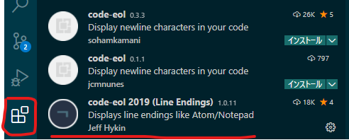

##### 2.改行コードが可視化される

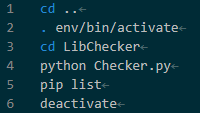

### ファイルアイコン変更

#### 1.左下の歯車マークからファイルアイコンの変更をクリック

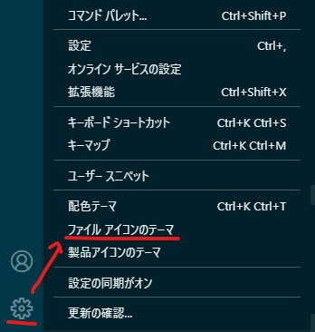

#### 2.コマンドパレットから任意のファイルアイコンテーマを選択

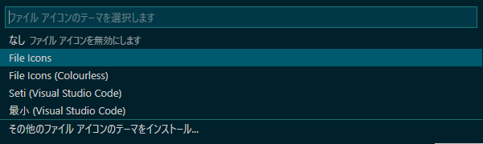

## ワークスペース

### ワークスペース追加方法

#### 1.ファイル-ワークスペースにフォルダーを追加の順に選択する

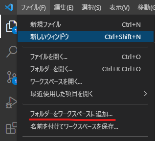

#### 2.ワークスペースとして追加するフォルダを選択する

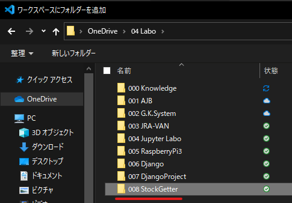

#### 3.ワークスペースとして選択されたフォルダの直下にworkspace.code-workspaceというファイルが作成される

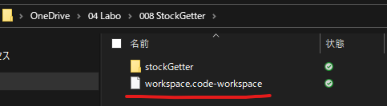

## git除外設定

### 1.ワークスペース直下に.gitignoreという名前のファイルを新規作成する

### 2.除外するファイル、フォルダを.gitignoreに記述する

```sh
CodeList/data_j.xls
log/
Lib/__pycache__
Model/__pycache__
```

### 3.ファイルが除外されない場合はキャッシュを削除する

```sh
# ファイルの場合
(projectDirectory)/git rm --cache <対象ファイル>
# ディレクトリの場合
(projectDirectory)/git rm -r --cache <対象ディレクトリ>
```

## ブランチ作成

### 1.新しい分岐の作成

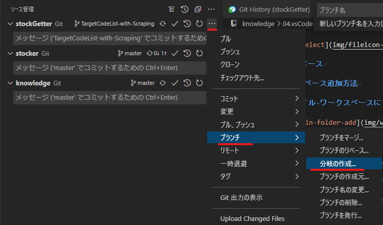

### 2.ブランチ名を入力

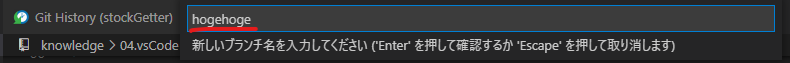

### 3.変更の発行(push)

## ブランチマージ

### 1.チェックアウト先をmainに変更する

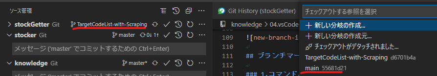

### 2.コマンドパレットにてGit:Mergeを選択(Ctrl+Shift+Pでコマンドパレット表示)

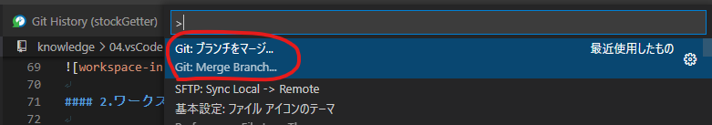

### 3.マージ対象となるリポジトリを選択

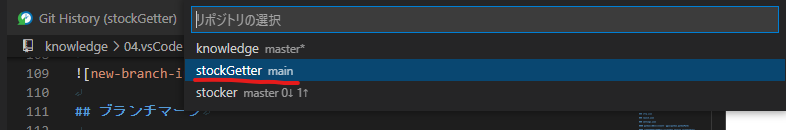

### 4.マージ対象となるブランチを選択

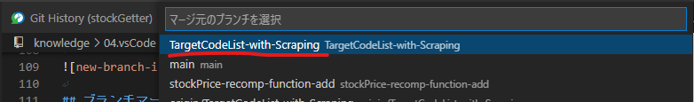

### 5.mainリポジトリをコミットする

### 6.githubへpushする
