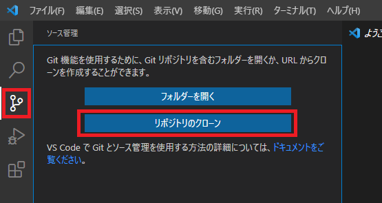

# vscode

1. ## vscodeインストール

   1. ## ダウンロード

      [Visual Sudio CodeのWebサイト](https://code.visualstudio.com/Download)より、インストーラーをダウンロード

      

   2. ## インストーラーを実行する

      1. ### 使用許諾契約書の同意

         

      2. ### 追加タスクの指定(デフォルトのまま)

         

      3. ### インストール実行

         

      

   3. ## 日本語化

      1. ### [View] - [Command Palette]を選択

         

      2. ### 入力欄に Configure Display Language と入力、または選択する

         

      3. ### 画面左パネルの一覧から「Japanese Language Packs for..」を選択してInstallボタンをクリックする

         

      4. ### vscodeの再起動確認があるので、vscodeを再起動する

      

2. ## Gitインストール及び初期設定

   [参考：Visual Studio Code（VSCode）でGitを使う（Windows 10環境）](https://cravelweb.com/webdesign/post-3876)

   1. ### 公式サイトよりインストーラーをダウンロードする

      

   2. ### インストールウィザードを下記の通り進める（基本はデフォルト値のままでOK）

   3. ### gitアカウントのユーザー名、Eメールアドレスを設定する

      ```sh
      $git config --global user.name '<user-name>'
      $git config --global user.email '<email-address>'
      ```

3. ## Python(3.9.6)インストール

   1. ### 公式サイトよりインストーラーをダウンロードする

   2. ### インストーラーを実行してPythonをインストールする

   3. ### インストール後、仮想環境のアクティベートを可能とする為に以下のコマンドをコマンドプロンプト(管理者権限)にて実行する

      ```shell
      >PowerShell Set-ExecutionPolicy RemoteSigned
      ```

      [参考：PowerShell のスクリプトが実行できない場合の対処方法](https://qiita.com/Targityen/items/3d2e0b5b0b7b04963750)

      

4. ## 拡張機能

   * Japanese Language Pack fro Visual Studio Code
   * Python
   * Ptyhon Extension Pack
     * Python Docstring Generator
     * Jinja
     * Django
     * Visual Studio IntelliCode
     * Python Indent
   * SFTP(liximomo)
   * Git History
   * Easy icon thema
   * vscode-workspace-switcher
   * Material Thema
   * Peacock
   
   
      * Prettier - Code formatter
   
   
      * Jupyter
   

5. ## vscode設定

### 	github連携

### 	sftp.json

### 	launch.json

### 	settings.json

#### 	pythonライブラリの場所指定(python.pythonPath)

#### 	単体テストファイル設定(python.testing.unittestArgs)

### 	改行コード

* シェルスクリプトファイルをVsCodeで編集してLinuxサーバーにアップする場合、改行コードCrLfだとshコマンドでシェルスクリプトファイルを実行時に「そのようなファイルやディレクトリはありません」と表示されることがある

#### 1.拡張機能にcode-eol 2019(Line Endings)を追加

##### 1.インストールボタンをクリック


##### 2.改行コードが可視化される


### ファイルアイコン変更

#### 1.左下の歯車マークからファイルアイコンの変更をクリック


#### 2.コマンドパレットから任意のファイルアイコンテーマを選択


## ワークスペース

### ワークスペース追加方法

#### 1.ファイル-ワークスペースにフォルダーを追加の順に選択する


#### 2.ワークスペースとして追加するフォルダを選択する


#### 3.ワークスペースとして選択されたフォルダの直下にworkspace.code-workspaceというファイルが作成される


## git除外設定

### 1.ワークスペース直下に.gitignoreという名前のファイルを新規作成する

### 2.除外するファイル、フォルダを.gitignoreに記述する

```sh
CodeList/data_j.xls
log/
Lib/__pycache__
Model/__pycache__
```

### 3.ファイルが除外されない場合はキャッシュを削除する

```sh
# ファイルの場合
(projectDirectory)/git rm --cache <対象ファイル>
# ディレクトリの場合
(projectDirectory)/git rm -r --cache <対象ディレクトリ>
```

## リポジトリクローン

### 1.githubでリポジトリ作成

#### 1.Newをクリック


#### 2.リポジトリ名を入力

#### 3.Privateに変更

#### 4.Add a README fileにチェックを入れる

#### 5.CreateRepositoryをクリック


### 2.リポジトリの場所となるフォルダを作成


### 3.VsCodeを起動する


### 4.ソース管理を開き、「リポジトリのクローン」をクリックする



### 5.リポジトリURLを指定する


## ブランチ作成

### 1.新しい分岐の作成


### 2.ブランチ名を入力


### 3.変更の発行(push)

## ブランチマージ

### 1.チェックアウト先をmainに変更する


### 2.コマンドパレットにてGit:Mergeを選択(Ctrl+Shift+Pでコマンドパレット表示)


### 3.マージ対象となるリポジトリを選択


### 4.マージ対象となるブランチを選択


### 5.mainリポジトリをコミットする

### 6.githubへpushする
