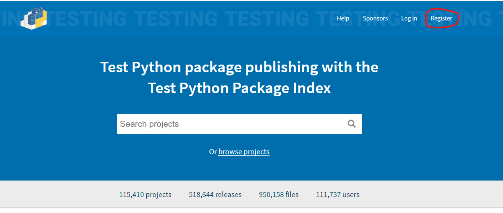
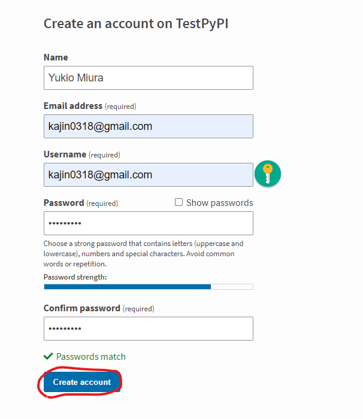
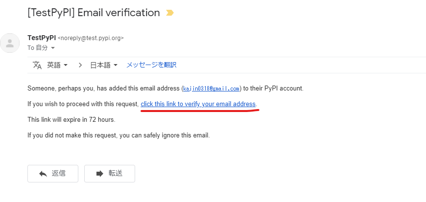
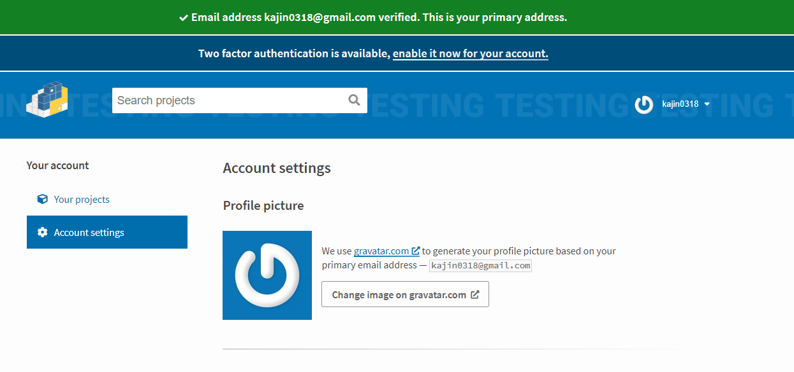

# Python

1. ## python3.6 インストール

   1. ### インストール

      ```sh
      $yum -y install python3
      ```

2. ## pip

   - python3系インストール後はpipが使用できないのでpip3を使う

   1. ### pip自身のアップグレード

      ```sh
      $pip3 install -U pip
      ```

   2. ### パッケージリストの確認

      ```sh
      $pip3 list
      ```

   3. ### アップデートが必要なパッケージのリスト確認

      ```sh
      $pip3 list -o
      ```

   4. ### requiremets.txtによる一括インストール

      ```sh
      $pip3 install -r requirements.txt
      
      # requirements.txt書き方(例)
      
      beautifulsoup4==4.9.3
      bs4==0.0.1
      configparser==5.0.2
      decorator==4.4.2
      numpy==1.19.5
      pandas==1.1.5
      pandas-datareader==0.9.0
      psycopg2==2.8.6
      requests==2.25.1
      six==1.15.0
      SQLAlchemy==1.4.18
      xlrd==2.0.1
      xlwt==1.3.0
      ```

   5. ### 現在の環境の設定ファイル書き出し

      ```
      $pip3 freeze > requirements.txt
      ```
      
   5. キャッシュクリア

      ```sh
      $pip3 cache purge
      ```

3. ## 仮想環境の作成

   1. ### venv

      ```sh
      $python3 -m venv <仮想環境名>
      ```

      下記のエラーが発生する場合の対処方

      ```sh
      $python3 -m venv env
      Error: Command '['/path/to/env/bin/python3', '-Im', 'ensurepip', '--upgrade', '--default-pip']' returned non-zero exit status 1
      ```

      1. #### pipなしで仮想環境を作成する

         ```sh
         $python3 -m venv --without-pip <仮想環境名>
         ```

      2. #### 仮想環境作成後、アクティベート

         ```sh
         $. <仮想環境パス>\bin\activate
         ```

      3. #### pipインストール

         ```sh
         (env)$curl -O https://bootstrap.pypa.io/get-pip.py
         (env)$python get-pip.py
         ```

      4. #### 仮想環境に入り直す

         ```sh
         (env)$deactivate
         $. <仮想環境パス>\bin\activate
         ```

      5. #### pipのインストールパスが仮想環境側を向いているか確認

         ```sh
         (env)$which pip
         (env)$~/****/env/bin/pip (仮想環境のpipになっていればOK)
         ```

      6. #### 上記作業を行うスクリプトファイル

         ```sh
         #!/bin/zsh
         set -eu
         python3 -m venv --without-pip <仮想環境名>
         curl -O https://bootstrap.pypa.io/get-pip.py
         (){ setopt local_options unset; . <仮想環境名>/bin/activate }
         python get-pip.py
         (){ setopt local_options unset; deactivate }
         (){ setopt local_options unset; . <仮想環境名>/bin/activate }
         ```

   2. ### アクティベート

      ```sh
      $. <仮想環境パス>\bin\activate
      ```

   3. ### 仮想環境下でpip,setuptools最新化

      ```sh
      (env)$pip install --upgrade pip
      (env)$pip install --upgrade pip setuptools
      ```

      windows環境下の場合は以下を実行(上記でも最新化できるがpipに対するアクセス拒否のエラーが発生する)

      ```sh
      (env)$python -m pip install --upgrade pip
      (env)$python -m pip install --upgrade setuptools
      ```

   4. ### ディアクティベート

      仮想環境から抜ける

      ```sh
      (env)$deactivate
      ```

4. ## numpyインストール

   * ハマったのでメモ

   * この時のpythonバージョンは3.6

   1. ### 環境インストール

      ```sh
      # gcc-gfortran,blas-devel,lapack-devel,freetypeインストール
      $yum install -y gcc-gfortran blas-devel lapack-devel freetype libpng-devel
      ```

   2. ### python36-develインストール

      ```sh
      # インストールするpython-develのバージョン調査
      $yum list available | grep python | grep devel
      
      # python-develインストール
      $yum install -y python36-devel
      
      # numpyのインストールに失敗する場合は以下をインストール
      $yum install -y python-devel
      ```

   3. ### numpyインストール

      ```sh
      $pip3 install numpy
      ```

5. ## pandas-datareaderインストール

   1. ### 環境インストール

      ```sh
      # libxml2-devel,libxslt-develインストール
      $yum install libxml2-devel libxslt-devel
      ```

   2. ### pandas-datareaderインストール

      ```sh
      $pip3 install pandas-datareader
      ```

6. ## psycopg2インストール

   1. ### 環境インストール

      ```sh
      # postgresql-develインストール
      $yum install postgresql-devel
      ```

   2. ### psycopg2インストール

      ```sh
      $pip3 install psycopg2
      ```

7. ## Pillowインストール

   1. ### 環境インストール

      ```sh
      # libjpeg-develインストール
      $yum install libjpeg-devel
      
      # freetype-develインストール
      $yum install freetype-devel
      ```

   2. ### Pillowインストール

      ```sh
      $pip3 install Pillow
      ```

8. ## PyPI登録

   1. ### TestPyPI(PyPI)アカウント登録

      1. #### TestPyPI(PyPI)のサイトへ移動

         * TestPyPI,PyPI双方でアカウントを作成(手順同じ)

             [TestPyPI](https://test.pypi.org/)  
             [PyPI](https://pypi.org/)

      2. #### トップページでRegisterをクリック

         

      3. #### アカウント情報を入力してCreate accountをクリック

         

      4. #### メールアドレスの認証メールが届くので認証用リンクをクリック

         * 認証メール送信案内

         * 

         * 

         * 認証メールにて認証用リンクをクリック

           

         * 認証成功

           

   2. ### 必要パッケージを仮想環境にインストール

      ```sh
      (env)$pip install setuptools wheel twine
      ```

   3. ### パッケージング

      ```sh
      (env)$python setup.py sdist bdist_wheel
      ```

   4. ### TestPyPIへアップロード

      ```sh
      (env)$twine upload --repository-url https://test.pypi.org/legacy/ dist/*
      ```

   5. ### TestPyPIユーザー認証

      ```sh
      Enter your username:(TestPyPIユーザー名入力)
      Enter your password:(TestPyPIユーザーパスワード入力)
      ```

   6. ### TestPyPIからpipインストール

      ```sh
      (env)$pip install --index-url https://test.pypi.org/simple/ --no-deps [パッケージ名]
      ```

   7. ### PyPIにアップロード

      ```sh
      (env)$twine upload dist/*
      ```

   8. ### PyPIからpipインストール

      ```sh
      (env)$pip install [パッケージ名]
      ```

1. ## Python3.9インストール

   1. ### yumアップデート

      念のため実行

      ```sh
      $yum -y update
      ```

      

   2. ### ツールのインストール

      ```sh
      $yum groupinstall "Development Tools" -y
      $yum install openssl-devel libffi-devel bzip2-devel -y
      ```

   3. ### Python3.9.7ダウンロード

      ```sh
      $wget https://www.python.org/ftp/python/3.9.7/Python-3.9.7.tgz
      ```

      - wgetが無い場合はインストール

        ```sh
        $yum install wget -y
        ```

   4. ### python3.9.7インストール

      1. #### 解凍

         ```sh
         $tar xvf Python-3.9.7.tgz
         ```

      2. #### 解凍したディレクトリに移動

         ```sh
         $cd Python-3.9*/
         ```

      3. #### <a href="#python39-build">ビルド</a>

         ```sh
         $./configure --enable-shared --enable-optimizations
         $make altinstall
         # --enable-sharedをオプション指定しないとmod_wsgiのように共有ライブラリを参照するパッケージのインストールでエラーとなる
         # altinstallはシンボリックリンクの作成を行わないインストール
         ```

      4. #### <a href="#python39-lib-copy">libpython3.9.so.1.0を参照可能な位置にコピー</a>

         ```sh
         # libpython3.9.so.1.0の場所を探す
         $find / -name libpython3.9.so.1.0
         
         # libpython3.9.so.1.0の場所が表示される
         /usr/local/lib/libpython3.9.so.1.0
         /root/Python-3.9.7/libpython3.9.so.1.0
         
         # libpython3.9.so.1.0を参照可能な/usr/libにコピー(32bit環境)
         $cp /usr/local/lib/libpython3.9.so.1.0 /usr/lib
         
         # libpython3.9.so.1.0を参照可能な/usr/libにコピー(64bit環境)
         $cp /usr/local/lib/libpython3.9.so.1.0 /usr/lib64
         ```
   
      5. #### バージョン確認
   
         ```sh
         $python3.9 -V
         
         Python 3.9.7
         ```
   
   5. ### シンボリックリンクの変更
   
      Python3.9をpython3で扱えるようにする
   
      1. #### 元のシンボリックリンク削除
   
         ```sh
         # python3.6のシンボリックリンク削除
         $rm -rf /usr/bin/python3
         ```
   
      2. #### python関連ファイルを検索
   
         ```sh
         $whereis python3
         
         # python3.9へのパスを確認
         python3: /usr/bin/python3.6 /usr/bin/python3 /usr/bin/python3.6m /usr/lib/python3.6 /usr/local/bin/python3.9-config /usr/local/bin/python3.9 /usr/local/lib/python3.6 /usr/local/lib/python3.9 /usr/include/python3.6m /usr/share/man/man1/python3.1.gz
         ```
   
      3. #### シンボリックリンク作成
   
         ```sh
         $ln -s /usr/bin/python3.9 /usr/bin/python3
         ```
   
      4. #### バージョン確認
   
         ```sh
         $python3 -V
         
         Python 3.9.7
         ```
   
         - pipも同様に変更する
   
           元のシンボリックリンク削除
   
           ```sh
           $rm -rf /usr/bin/pip3
           ```
   
           シンボリックリンク作成
   
           ```sh
           $ln -s /usr/bin/pip3.9 /usr/bin/pip3
           ```
   
           バージョン確認
   
           ```sh
           $pip3 -V
           
           pip 21.2.3 from /usr/local/lib/python3.9/site-packages/pip (python 3.9)
           ```
   
      5. コマンドライン引数
      
         [参考：コマンドラインと環境](https://docs.python.org/ja/3.5/using/cmdline.html)
      
         - -m <module name>
      
           > 引数は module 名なので、拡張子 (.py) を含めてはいけません。モジュール名は有効な Python の絶対モジュール名 (absolute module name) であるべきですが、実装がそれを強制しているとは限りません (例えば、ハイフンを名前に含める事を許可するかもしれません)。
           >
           > パッケージ名 (名前空間パッケージも含む) でも構いません。通常のモジュールの代わりにパッケージ名が与えられた場合、インタプリタは <pkg>.__main__ を main モジュールとして実行します。この挙動はスクリプト引数として渡されたディレクトリや zip ファイルをインタプリタが処理するのと意図的に同じにしています。
