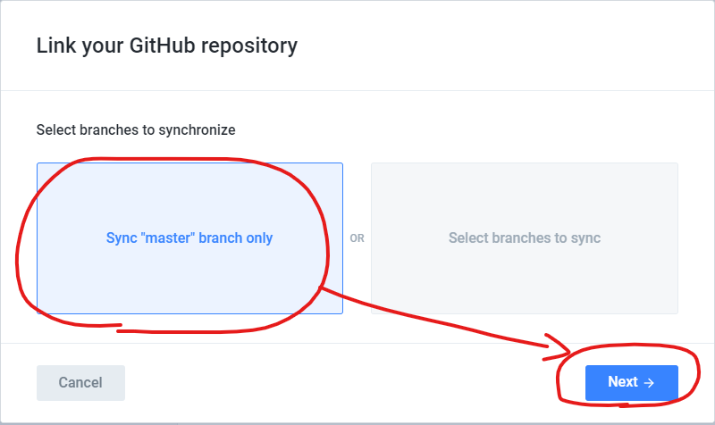

# git関連

## git
  
  1. インストール

## github
  
  1. アカウント作成
  
  2. リポジトリ作成
  
  3. リポジトリクローン
  
  4. リポジトリ削除
  
  5. VsCodeからgithubへプッシュ
  
## gitbookとgithubの連携

  1. gitbookアカウント作成
  
      [gitbook.com](https://www.gitbook.com/)

      ※gitbookでドキュメントを直接編集しなければFreeプランで問題ない

  2. ログイン後、左端にあるIntegretionsからgithubとの連携を有効にする

      
  
  3. githubとgitbookの認証連携の承認画面が表示されるので承認する(画像取り忘れた...)

  4. リンクするリポジトリはmasterを指定

      

  5. Go Liveをクリックしてgithubのリポジトリの内容が表示されることを確認する
  