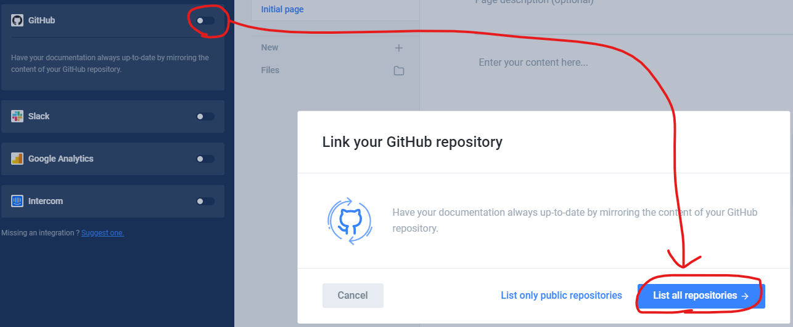
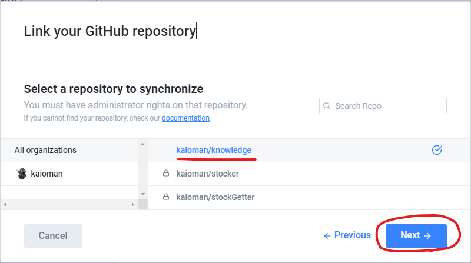
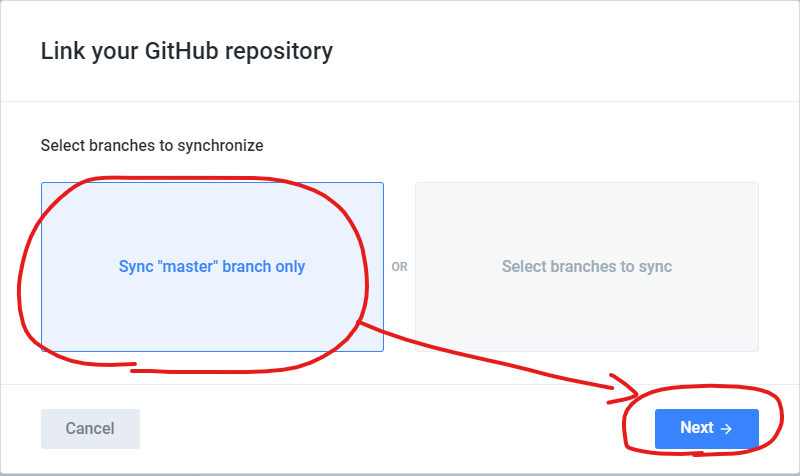
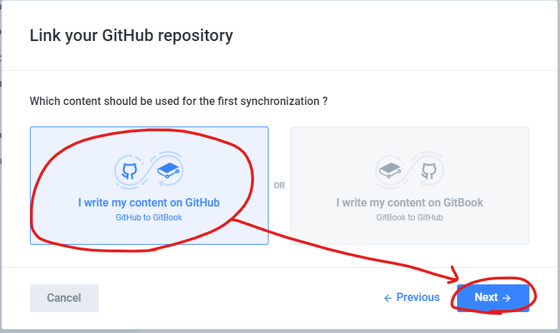
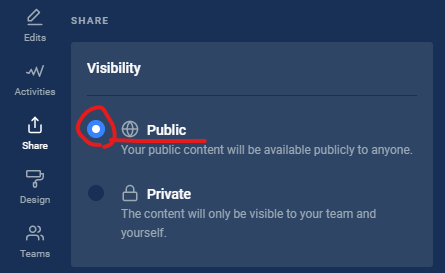

# git

1. ## git

   1. インストール

2. ## github

   1. アカウント作成
   2. リポジトリ作成
   3. リポジトリクローン
   4. リポジトリ削除
   5. vscodeからgithubへプッシュ

3. ## gitbookとgithubの連携

   1. ### gitbookアカウント作成

      [gitbook.com](https://www.gitbook.com/)

      ※gitbookでドキュメントを直接編集しなければFreeプランで問題ない

   2. ### ログイン後、左端にあるIntegretionsからgithubとの連携を有効にする

      

   3. ### githubとgitbookの認証連携の承認画面が表示されるので承認する(初回のみ)

   4. ### 連携するgithub側のリポジトリを指定する

      

   5. ### リンクするリポジトリをmasterに限定するか指定

      「Sync "master" branch only」を指定

      

   6. ### コンテンツの編集元を指定

      - 「I write my content on GitHub」を指定

        

   7. ### Go Liveをクリックしてgithubのリポジトリの内容が表示されることを確認する

4. ## gitbook.comで作成したドキュメントの公開

   1. ### [Share]→[Visibility]から Public を選択

      

   2. ### Shareable Linkにて公開用のURLが確認できる

      
